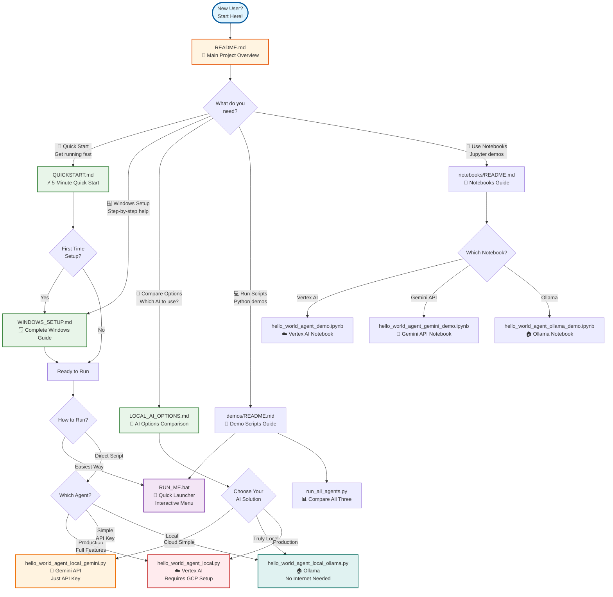

# Documentation Guide - Where to Start

This guide helps you navigate all the documentation files in this project.

## 🗺️ Documentation Flow



## 📚 Documentation Files Overview

### Main Documentation

| File | Purpose | When to Use |
|------|---------|-------------|
| **[README.md](README.md)** | Main project overview | Start here for project introduction |
| **[QUICKSTART.md](QUICKSTART.md)** | 5-minute quick start | Want to get running fast |
| **[WINDOWS_SETUP.md](WINDOWS_SETUP.md)** | Complete Windows guide | Windows user, need detailed setup |
| **[LOCAL_AI_OPTIONS.md](LOCAL_AI_OPTIONS.md)** | AI options comparison | Deciding which AI solution to use |

### Code Documentation

| File | Purpose | When to Use |
|------|---------|-------------|
| **[demos/README.md](week-01-gemini-fundamentals/demos/README.md)** | Demo scripts guide | Running Python scripts |
| **[notebooks/README.md](week-01-gemini-fundamentals/notebooks/README.md)** | Notebooks guide | Using Jupyter notebooks |
| **[demos/QUICK_RUN.md](week-01-gemini-fundamentals/demos/QUICK_RUN.md)** | Quick run reference | Quick reference for running scripts |
| **[demos/README_RUN.md](week-01-gemini-fundamentals/demos/README_RUN.md)** | Run instructions | Detailed run instructions |

## 🎯 Recommended Paths

### Path 1: Quick Start (5 minutes)
```
QUICKSTART.md → Setup → RUN_ME.bat → Select Agent
```

### Path 2: Windows User (First Time)
```
WINDOWS_SETUP.md → setup-windows.bat → activate-env.bat → RUN_ME.bat
```

### Path 3: Compare Options First
```
LOCAL_AI_OPTIONS.md → Choose Option → Setup → Run Agent
```

### Path 4: Notebook User
```
notebooks/README.md → jupyter notebook → Open Notebook → Run Cells
```

### Path 5: Direct Script Runner
```
demos/README.md → activate-env.bat → python script_name.py
```

## 🚀 Quick Decision Tree

**I want to...**

- **Get started in 5 minutes** → [QUICKSTART.md](QUICKSTART.md)
- **Set up on Windows** → [WINDOWS_SETUP.md](WINDOWS_SETUP.md)
- **Understand my options** → [LOCAL_AI_OPTIONS.md](LOCAL_AI_OPTIONS.md)
- **Run code easily** → `cd week-01-gemini-fundamentals\demos` then `RUN_ME.bat`
- **Use notebooks** → [notebooks/README.md](week-01-gemini-fundamentals/notebooks/README.md)
- **See all documentation** → [README.md](README.md)

## 💡 Pro Tips

1. **First time?** Start with [QUICKSTART.md](QUICKSTART.md)
2. **Windows user?** Bookmark [WINDOWS_SETUP.md](WINDOWS_SETUP.md)
3. **Not sure which AI?** Read [LOCAL_AI_OPTIONS.md](LOCAL_AI_OPTIONS.md) first
4. **Want easiest way?** Use `RUN_ME.bat` - it handles everything
5. **Prefer notebooks?** Check [notebooks/README.md](week-01-gemini-fundamentals/notebooks/README.md)

## 🔗 All Documentation Files

- [README.md](README.md) - Main project documentation
- [QUICKSTART.md](QUICKSTART.md) - Quick start guide
- [WINDOWS_SETUP.md](WINDOWS_SETUP.md) - Windows setup guide
- [LOCAL_AI_OPTIONS.md](LOCAL_AI_OPTIONS.md) - AI options comparison
- [week-01-gemini-fundamentals/demos/README.md](week-01-gemini-fundamentals/demos/README.md) - Demo scripts
- [week-01-gemini-fundamentals/notebooks/README.md](week-01-gemini-fundamentals/notebooks/README.md) - Notebooks guide
- [week-01-gemini-fundamentals/demos/QUICK_RUN.md](week-01-gemini-fundamentals/demos/QUICK_RUN.md) - Quick run reference
- [week-01-gemini-fundamentals/demos/README_RUN.md](week-01-gemini-fundamentals/demos/README_RUN.md) - Run instructions

