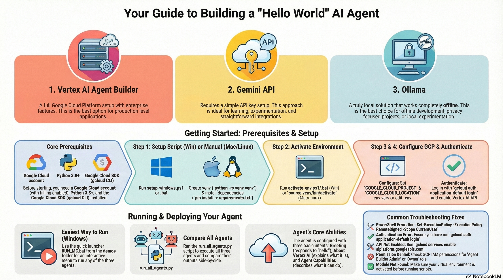
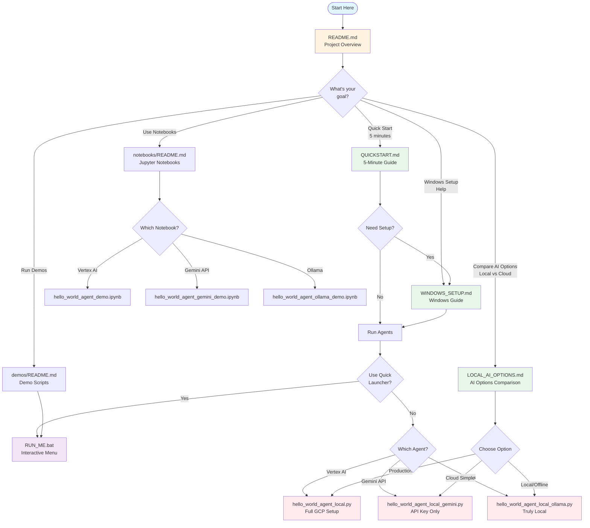

# Vertex AI Agent Builder - Hello World Project

> **Hello World AI Agent project demonstrating Vertex AI Agent Builder, Gemini API, and Ollama - includes local and cloud deployment examples with Jupyter notebooks**



This project demonstrates how to create and deploy a "Hello World" agent using three different approaches: Vertex AI Agent Builder (full GCP), Gemini API (simple cloud), and Ollama (truly local). Includes Python scripts, Jupyter notebooks, and deployment guides.

## 📖 Documentation Guide



### Quick Navigation

- **New to the project?** → Start with [QUICKSTART.md](QUICKSTART.md)
- **Windows user?** → See [WINDOWS_SETUP.md](WINDOWS_SETUP.md)
- **Want to compare options?** → Read [LOCAL_AI_OPTIONS.md](LOCAL_AI_OPTIONS.md)
- **Ready to run code?** → Check [demos/README.md](week-01-gemini-fundamentals/demos/README.md)
- **Prefer notebooks?** → See [notebooks/README.md](week-01-gemini-fundamentals/notebooks/README.md)

## 📁 Project Structure

```
week-01-gemini-fundamentals/
├── notebooks/          # Jupyter notebooks for experimentation
│   ├── hello_world_agent_demo.ipynb          # Vertex AI demo
│   ├── hello_world_agent_gemini_demo.ipynb   # Gemini API demo
│   └── hello_world_agent_ollama_demo.ipynb   # Ollama demo
├── blog-posts/         # Blog posts and documentation
└── demos/              # Demo scripts and examples
    ├── hello_world_agent_local.py            # Vertex AI agent
    ├── hello_world_agent_local_gemini.py     # Gemini API agent
    ├── hello_world_agent_local_ollama.py     # Ollama agent
    ├── deploy_agent.py                       # Cloud deployment
    ├── run_all_agents.py                     # Comparison script
    ├── RUN_ME.bat                            # Quick launcher (Windows)
    └── RUN_ME.ps1                            # Quick launcher (PowerShell)
```

## 🚀 Quick Start

### Prerequisites

1. **Google Cloud Account**: You need a GCP account with billing enabled
2. **Python 3.8+**: Ensure Python is installed
3. **Google Cloud SDK**: Install [gcloud CLI](https://cloud.google.com/sdk/docs/install)
4. **Vertex AI API**: Enable Vertex AI API in your GCP project

### Setup

#### Windows Setup (Recommended)

> 📖 **Detailed Windows instructions:** See [WINDOWS_SETUP.md](WINDOWS_SETUP.md) for complete guide

1. **Run the Windows setup script**:
   ```powershell
   # PowerShell (Recommended)
   .\setup-windows.ps1
   
   # Or Command Prompt
   setup-windows.bat
   ```
   This will:
   - Create a Python virtual environment
   - Install all dependencies
   - Set up environment configuration
   
   **Note:** If you get a PowerShell execution policy error, run:
   ```powershell
   Set-ExecutionPolicy -ExecutionPolicy RemoteSigned -Scope CurrentUser
   ```

2. **Activate the environment** (if not already activated):
   ```powershell
   # PowerShell
   .\activate-env.ps1
   
   # Or Command Prompt
   activate-env.bat
   ```

3. **Configure your GCP project**:
   - Edit `.env` file (created automatically) or set environment variables:
   ```powershell
   # PowerShell
   $env:GOOGLE_CLOUD_PROJECT="your-project-id"
   $env:GOOGLE_CLOUD_LOCATION="us-central1"
   
   # Command Prompt
   set GOOGLE_CLOUD_PROJECT=your-project-id
   set GOOGLE_CLOUD_LOCATION=us-central1
   ```

4. **Set up Google Cloud credentials**:
   ```powershell
   gcloud auth application-default login
   ```

5. **Enable Vertex AI API**:
   ```powershell
   gcloud services enable aiplatform.googleapis.com --project=$env:GOOGLE_CLOUD_PROJECT
   ```

#### Linux/Mac Setup

1. **Create and activate virtual environment**:
   ```bash
   python -m venv venv
   source venv/bin/activate  # On Mac/Linux
   ```

2. **Install dependencies**:
   ```bash
   pip install -r requirements.txt
   ```

3. **Set up Google Cloud credentials**:
   ```bash
   gcloud auth application-default login
   ```

4. **Set environment variables**:
   ```bash
   export GOOGLE_CLOUD_PROJECT="your-project-id"
   export GOOGLE_CLOUD_LOCATION="us-central1"
   ```

5. **Enable Vertex AI API**:
   ```bash
   gcloud services enable aiplatform.googleapis.com --project=$GOOGLE_CLOUD_PROJECT
   ```

## 🏃 Running the Agents

**Make sure your virtual environment is activated first!**

### Quick Launcher (Easiest - Windows)

From the demos folder, use the quick launcher:
```cmd
cd week-01-gemini-fundamentals\demos
RUN_ME.bat
```

This provides an interactive menu to run any of the three agents.

### Three Hello World Agents Available

This project includes **three different Hello World agent implementations**:

1. **Vertex AI Agent Builder** (`hello_world_agent_local.py`)
   - Full GCP setup required
   - Best for: Production, enterprise features
   ```bash
   python week-01-gemini-fundamentals\demos\hello_world_agent_local.py
   ```

2. **Gemini API** (`hello_world_agent_local_gemini.py`)
   - Simple API key setup
   - Best for: Quick development, learning
   ```bash
   python week-01-gemini-fundamentals\demos\hello_world_agent_local_gemini.py
   ```

3. **Ollama** (`hello_world_agent_local_ollama.py`)
   - Truly local, works offline
   - Best for: Offline development, privacy
   ```bash
   python week-01-gemini-fundamentals\demos\hello_world_agent_local_ollama.py
   ```

### Comparison Script

Run all three agents and compare:
```bash
python week-01-gemini-fundamentals\demos\run_all_agents.py
```

See [LOCAL_AI_OPTIONS.md](LOCAL_AI_OPTIONS.md) for detailed comparison of all three options.

## ☁️ Deploying to Cloud

Deploy your agent to Vertex AI Agent Builder Console:

```bash
python demos/deploy_agent.py
```

This script will:
- Generate agent configuration
- Create `agent_config.json` with flow definitions
- Provide step-by-step instructions for console deployment

### Manual Deployment Steps

1. **Open Vertex AI Agent Builder Console**:
   - Go to: https://console.cloud.google.com/ai/agents
   - Select your project

2. **Create a New Agent**:
   - Click "Create Agent"
   - Use the configuration from `agent_config.json`:
     - Display Name: "Hello World Agent"
     - Language: English
     - Time Zone: America/New_York

3. **Add Intents and Flows**:
   - Import or manually create the flows from `agent_config.json`
   - The configuration includes:
     - `greeting` intent
     - `about_vertex_ai` intent
     - `agent_capabilities` intent

4. **Train and Deploy**:
   - Click "Train" to train your agent
   - Once trained, click "Deploy" to make it available

5. **Test Your Agent**:
   - Use the built-in test console
   - Try phrases like:
     - "Hello"
     - "What is Vertex AI?"
     - "What can you do?"

## 📚 Agent Configuration

The agent includes three basic intents:

1. **Greeting**: Responds to hello/hi/hey
2. **About Vertex AI**: Explains what Vertex AI is
3. **Agent Capabilities**: Describes what the agent can do

See `agent_config.json` (generated after running `deploy_agent.py`) for the complete configuration.

## 🔧 Troubleshooting

### Common Issues

1. **PowerShell Execution Policy Error (Windows)**:
   ```powershell
   Set-ExecutionPolicy -ExecutionPolicy RemoteSigned -Scope CurrentUser
   ```
   Then run `.\setup-windows.ps1` again.

2. **Virtual Environment Not Found**:
   - Run the setup script first: `.\setup-windows.ps1` or `setup-windows.bat`
   - Make sure you're in the project root directory

3. **Authentication Error**:
   ```bash
   gcloud auth application-default login
   ```

4. **API Not Enabled**:
   ```bash
   gcloud services enable aiplatform.googleapis.com
   ```

5. **Permission Denied**:
   - Ensure you have "Agent Builder Admin" or "Owner" role
   - Check IAM permissions in GCP Console

6. **Project ID Not Set**:
   - Verify `GOOGLE_CLOUD_PROJECT` environment variable
   - Check your `.env` file (Windows setup creates this automatically)
   - Or set it manually in PowerShell: `$env:GOOGLE_CLOUD_PROJECT="your-project-id"`

7. **Module Not Found Errors**:
   - Make sure virtual environment is activated
   - Reinstall dependencies: `pip install -r requirements.txt`

## 📖 Resources

- [Vertex AI Agent Builder Documentation](https://cloud.google.com/vertex-ai/docs/agent-builder)
- [Vertex AI Python SDK](https://cloud.google.com/python/docs/reference/aiplatform/latest)
- [Dialogflow CX Documentation](https://cloud.google.com/dialogflow/cx/docs)

## 📓 Jupyter Notebooks

Interactive notebooks are available for all three agents:

- `hello_world_agent_demo.ipynb` - Vertex AI Agent Builder
- `hello_world_agent_gemini_demo.ipynb` - Gemini API
- `hello_world_agent_ollama_demo.ipynb` - Ollama (truly local)

To run notebooks:
```bash
# Activate environment first
.\activate-env.ps1  # or activate-env.bat

# Start Jupyter
jupyter notebook
# or
jupyter lab
```

## 🎯 Next Steps

1. **Try all three agents** - Compare Vertex AI, Gemini API, and Ollama
2. **Explore the notebooks** - Interactive demos for each agent type
3. **Use the quick launcher** - `RUN_ME.bat` for easy access
4. **Customize the agents** - Modify intents, flows, and prompts
5. **Deploy to cloud** - Use Vertex AI for production deployment

## 📚 Additional Resources

- [LOCAL_AI_OPTIONS.md](LOCAL_AI_OPTIONS.md) - Detailed comparison of all three options
- [QUICKSTART.md](QUICKSTART.md) - 5-minute quick start guide
- [WINDOWS_SETUP.md](WINDOWS_SETUP.md) - Complete Windows setup guide
- [demos/README.md](week-01-gemini-fundamentals/demos/README.md) - Demo scripts documentation

## 📝 License

This project is for educational purposes.


